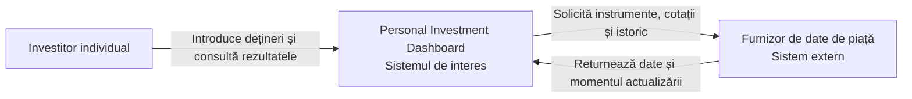

Laboratorul 1 — Definirea produsului inițial
Personal Investment Dashboard
Disciplina: Proiectarea sistemelor  
Student: Marjina Lilian  
Grupa: Infa-241  
Data: 21 septembrie 2026
Rezumat
Lucrarea transformă cererea generală „Ajută-mă să îmi urmăresc investițiile” într-un contract coerent pentru prima versiune a unui Personal Investment Dashboard.
Produsul îi permite unui investitor individual să introducă manual deținerile, să consulte informațiile disponibile despre piață și să înțeleagă valoarea și performanța portofoliului. Tranzacționarea, conectarea la brokeri și recomandările de investiții sunt excluse intenționat.
---
1. Cercetarea produsului
1.1 Produse analizate
Produs	Utilizator principal	Funcții observate
Yahoo Finance	Investitor individual	Dețineri, valoare curentă, variație zilnică și câștig total
TradingView	Investitor sau trader	Portofoliu manual, tranzacții, dețineri și performanță
TradingView confirmă și două situații importante pentru definirea produsului:
portofoliul poate fi creat manual;
un instrument nesuportat trebuie tratat explicit.
1.2 Concluzia cercetării
Prima versiune va combina două modele observate:
introducerea manuală a deținerilor și a datelor investiției;
afișarea clară a valorii și performanței portofoliului.
Nu vor fi incluse ordine de cumpărare sau vânzare, conectarea la broker, analiza tehnică avansată ori recomandările de investiții. Dacă un instrument sau o informație de piață nu este disponibilă, produsul va prezenta explicit această situație și nu va afișa un rezultat fals.
1.3 Demonstrarea cercetării
În timpul prezentării vor fi demonstrate paginile publice Yahoo Finance Portfolios, TradingView Portfolios și TradingView Unsupported Assets. Pentru fiecare produs se va explica modelul observat și decizia de domeniu rezultată.
---
2. Părți interesate și actori
2.1 Matricea motivație–influență
Parte interesată	Motivație	Influență	Justificare
Investitor individual	Ridicată	Ridicată	Folosește produsul și validează rezultatele
Proprietarul produsului	Ridicată	Ridicată	Definește prioritățile și aprobă domeniul
Echipa de livrare	Ridicată	Scăzută	Realizează și verifică cerințele
Furnizorul de date	Scăzută	Ridicată	Controlează disponibilitatea datelor
Autoritatea de protecție	Scăzută	Ridicată	Poate impune reguli de informare

Motivație	Influență scăzută	Influență ridicată
Ridicată	Echipa de livrare	Investitorul și proprietarul produsului
Scăzută	Niciun candidat critic	Furnizorul de date și autoritatea de protecție
2.2 Clasificarea candidaților
Candidat	Clasificare	Interacțiune	C4
Investitor individual	Actor uman	Introduce dețineri și consultă rezultatele	Da
Furnizor de date	Sistem extern	Furnizează cotații și istoric	Da
Proprietarul produsului	Parte interesată	Decide domeniul produsului	Nu
Echipa de livrare	Parte interesată	Construiește și verifică produsul	Nu
Autoritatea de protecție	Parte interesată	Poate impune reguli	Nu
---
3. Promisiunea și domeniul de aplicare
3.1 Promisiunea produsului
Personal Investment Dashboard ajută investitorul individual să centralizeze deținerile introduse manual și să înțeleagă valoarea și performanța lor pe baza datelor de piață disponibile, astfel încât să poată urmări portofoliul într-un singur loc și să distingă rezultatele curente de cele incomplete sau învechite.
3.2 Obiectivele primei versiuni
Permite investitorului să înregistreze manual o investiție într-un instrument acceptat, împreună cu datele necesare urmăririi.
Arată deținerile portofoliului cu prețul de piață disponibil și momentul actualizării.
Arată valoarea curentă estimată a portofoliului și câștigul sau pierderea totală pe baza datelor disponibile.
Permite investitorului să observe evoluția portofoliului într-o perioadă selectată și să distingă datele incomplete sau învechite.
Permite investitorului să corecteze sau să elimine datele introduse, iar rezultatele portofoliului se actualizează corespunzător.
3.3 Non-obiective
Executarea ordinelor de cumpărare sau vânzare și conectarea la un broker.
Importul și sincronizarea automată a conturilor sau tranzacțiilor de la brokeri, bănci ori burse.
Furnizarea de recomandări de investiții, prognoze sau sfaturi personalizate.
3.4 Constrângeri și ipoteze
Tip	Afirmație	Consecință
Constrângere	Produsul nu execută tranzacții	Cumpărarea și vânzarea rămân în afara produsului
Constrângere	Deținerile sunt introduse manual	Nu există conectare sau sincronizare cu brokerul
Constrângere	Sunt acceptate doar instrumentele recunoscute	Instrumentele nesuportate sunt marcate explicit
Ipoteză	Investitorul cunoaște datele investiției	Datele invalide trebuie corectate înaintea calculelor
Ipoteză	Furnizorul oferă cotații cu ora actualizării	Datele pot fi marcate ca actuale, învechite sau indisponibile
---
4. Cerințe funcționale
Fiecare cerință folosește modelul Card, Conversation, Confirmation. Povestea exprimă valoarea pentru actor, iar Definition of Done conține rezultate observabile, fără a impune tehnologii sau detalii interne de implementare.
DASH-1 — Înregistrarea unei investiții
User Story: Ca investitor individual, vreau să înregistrez un instrument, cantitatea și costul investiției, astfel încât portofoliul meu să reflecte deținerea reală.
Definition of Done:
Pentru un instrument acceptat și date valide, deținerea apare în portofoliu cu cantitatea și costul introduse.
Dacă instrumentul nu este acceptat, produsul îl marchează ca nesuportat și nu îl include într-un rezultat valid.
Dacă lipsesc valori obligatorii sau sunt invalide, produsul indică ce trebuie corectat și nu confirmă înregistrarea.
DASH-2 — Consultarea deținerilor și a pieței
User Story: Ca investitor individual, vreau să văd deținerile, prețurile disponibile și momentul actualizării, astfel încât să știu ce informație este curentă.
Definition of Done:
Fiecare deținere acceptată arată cantitatea, prețul disponibil și momentul ultimei actualizări.
Dacă prețul lipsește, produsul marchează informația ca indisponibilă și nu inventează o valoare.
Dacă ultima cotație este mai veche decât limita acceptată, produsul o marchează explicit ca învechită.
DASH-3 — Valoarea și rezultatul portofoliului
User Story: Ca investitor individual, vreau să văd valoarea curentă estimată și câștigul sau pierderea totală, astfel încât să înțeleg rezultatul portofoliului.
Definition of Done:
Când toate informațiile necesare sunt disponibile, produsul arată valoarea portofoliului și câștigul sau pierderea față de costul înregistrat.
Rezultatul arată moneda și momentul informațiilor folosite.
Dacă o cotație necesară lipsește ori este învechită, evaluarea este marcată ca incompletă și este identificată deținerea afectată.
DASH-4 — Urmărirea performanței
User Story: Ca investitor individual, vreau să consult evoluția portofoliului pentru o perioadă selectată, astfel încât să înțeleg direcția și mărimea schimbării.
Definition of Done:
Pentru o perioadă disponibilă, produsul arată schimbarea valorii și performanța pe baza deținerilor și a istoricului disponibil.
Perioada analizată și baza comparației sunt prezentate clar împreună cu rezultatul.
Dacă istoricul necesar este incomplet sau indisponibil, produsul arată limitarea și nu prezintă performanța ca fiind completă.
DASH-5 — Corectarea portofoliului
User Story: Ca investitor individual, vreau să modific sau să elimin o investiție înregistrată, astfel încât portofoliul și rezultatele sale să rămână corecte.
Definition of Done:
După confirmarea unei modificări valide, cantitatea, costul și rezultatele dependente reflectă noile date.
După confirmarea eliminării, înregistrarea nu mai contribuie la valoarea și performanța portofoliului.
Dacă modificarea conține valori invalide, produsul păstrează ultima înregistrare validă și indică ce trebuie corectat.
---
5. Limita sistemului
În interiorul Dashboard-ului	În afara Dashboard-ului
Primește și validează deținerile introduse manual.	Investitorul decide ce deține și furnizează datele investiției.
Solicită și interpretează instrumentele, cotațiile și istoricul.	Furnizorul de date deține informațiile originale.
Calculează și explică valoarea și performanța.	Brokerii și bursele execută tranzacțiile.
Marchează rezultatele nesuportate, indisponibile, incomplete sau învechite.	Furnizorul extern controlează acoperirea și disponibilitatea datelor.
Aplică modificările și eliminările confirmate.	Deciziile de investiții aparțin investitorului sau unui profesionist autorizat.
5.1 Contractul dependenței externe
Element	Definiție
Responsabilitatea dependentă de sistemul extern	Recunoașterea instrumentelor și furnizarea cotațiilor și istoricului.
Rezultatul furnizat extern	Instrument acceptat/nesuportat, cotație disponibilă/indisponibilă, istoric și momentul actualizării.
Ce vede utilizatorul la defectare	Nesuportat, indisponibil, incomplet sau învechit, fără transformarea unui rezultat necunoscut într-un succes.
Responsabilitatea Dashboard-ului	Solicită și interpretează datele, calculează numai când acestea sunt potrivite și explică starea rezultatului.
---
6. C4 System Context

Diagrama arată:
Investitorul individual — singurul actor uman direct al primei versiuni.
Personal Investment Dashboard — sistemul de interes care gestionează urmărirea, calculele și explicarea rezultatelor.
Furnizorul de date de piață — sistemul extern care furnizează identificatorii instrumentelor, cotațiile și istoricul.
Proprietarul produsului, echipa de livrare și autoritatea de protecție sunt părți interesate, dar nu participă direct în fluxul urmăririi portofoliului și nu apar în această diagramă.
---
7. Verificarea consecvenței
7.1 Trasabilitatea obiectivelor
Obiectiv	Cerință	Dovadă observabilă
G1 — Înregistrare manuală	DASH-1	O deținere validă apare; una nesuportată nu este acceptată ca validă.
G2 — Dețineri și piață	DASH-2	Sunt vizibile prețul, momentul actualizării și starea datelor.
G3 — Valoare și rezultat	DASH-3	Valoarea și câștigul/pierderea sunt complete sau marcate ca incomplete.
G4 — Performanță	DASH-4	Perioada, baza comparației și limitele istoricului sunt vizibile.
G5 — Corectare	DASH-5	Modificarea sau eliminarea actualizează rezultatele portofoliului.
7.2 Checklist final
[x] Au fost cercetate două produse existente.
[x] Cercetarea a confirmat urmărirea manuală și a exclus tranzacționarea și integrarea cu brokeri.
[x] Motivația și influența părților interesate sunt argumentate și consecvente.
[x] Actorul uman, sistemul extern și celelalte părți interesate sunt clasificate separat.
[x] Promisiunea produsului este clară.
[x] Există exact cinci obiective și trei non-obiective.
[x] Există cinci User Stories, fiecare cu trei criterii Definition of Done observabile.
[x] Situațiile nesuportat, indisponibil, incomplet și învechit sunt tratate explicit.
[x] Limita sistemului și diagrama C4 descriu aceleași responsabilități și dependențe.
[x] Nu sunt selectate tehnologii și nu apar componente interne în System Context.
